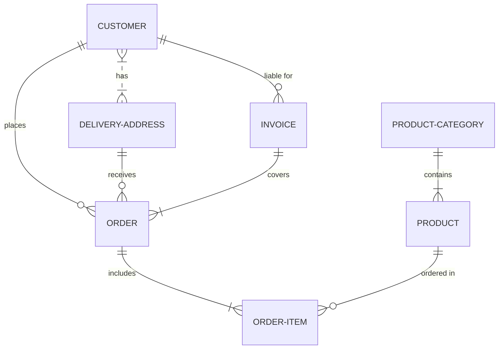

# github-demo
# Edited using: https://mermaid.js.org/syntax/stateDiagram.html

A simple demo repository to understand GIT.

This sentence uses `$` delimiters to show math inline:  $\sqrt{3x-1}+(1+x)^2$

